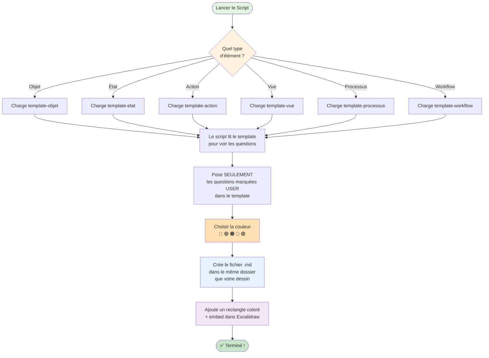

# Explication Simple - Script create-element-from-template.md v2.0.0

**Version** : 2.0.0  
**Date** : 2025-01-18  
**Auteur** : Rolland MELET & Claude Code

---

## 🎯 But du Script

Ce script crée automatiquement des éléments ProcessMetaLanguage dans vos dessins Excalidraw en utilisant des templates intelligents.

---

## 📝 Résumé Simple

**Le script fait 7 étapes principales :**

1. **CHOIX** : Vous demande quel type d'élément créer (Objet, État, Action, etc.)
2. **TEMPLATE** : Va chercher le bon template dans votre dossier Obsidian
3. **ANALYSE** : Lit le template pour savoir quelles questions poser
4. **QUESTIONS** : Vous pose UNIQUEMENT les questions nécessaires
5. **COULEUR** : Vous fait choisir une couleur
6. **FICHIER** : Crée le fichier .md à côté de votre dessin
7. **VISUEL** : Ajoute l'élément coloré dans Excalidraw

---

## 🔄 Flux Simplifié



---

## 🔑 Points Clés à Comprendre

### 1️⃣ **Où sont les templates ?**

Le script cherche les templates dans le dossier configuré dans vos **Settings Obsidian** :
- Par défaut : `Templates/BackOfCard/`
- Configurable dans : Settings → Templates → Template folder location

**⚠️ IMPORTANT** : Les templates DOIVENT être dans votre vault Obsidian, pas ailleurs !

### 2️⃣ **Où sont créés les fichiers ?**

Les fichiers sont créés **dans le même dossier** que votre fichier Excalidraw actif.
- Si vous êtes dans `Projets/Projet_B/`
- Le fichier sera créé dans `Projets/Projet_B/MonElement.md`

### 3️⃣ **Questions Dynamiques**

Le script ne pose QUE les questions définies comme `source: "user"` dans le template.

**Exemple pour un OBJET :**
- Nom de l'objet ? ✅ (demandé)
- Description ? ✅ (demandé)
- Catégorie ? ✅ (demandé)
- ID unique ? ❌ (généré automatiquement)
- Date création ? ❌ (généré automatiquement)

---

## 🎨 Éléments Visuels Créés

```
┌─────────────────────────┐
│  🔵 OBJET               │  ← Rectangle coloré (header)
│     Mon Objet           │     avec icône et nom
├─────────────────────────┤
│                         │
│    [Fichier Embed]      │  ← Zone d'embed du fichier .md
│                         │     (affiche le contenu)
│                         │
└─────────────────────────┘
```

---

## 🛠️ Configuration Requise

### Dans Obsidian Settings

1. **Templates folder** : Doit pointer vers votre dossier de templates
   - Exemple : `ProcessMetaLanguage/Templates`

### Structure des Dossiers

```
Votre Vault Obsidian/
├── ProcessMetaLanguage/
│   ├── Templates/
│   │   └── BackOfCard/
│   │       ├── template-objet-backofcard.md
│   │       ├── template-etat-backofcard.md
│   │       ├── template-action-backofcard.md
│   │       └── ...
│   └── Scripts/
│       └── create-element-from-template.md
└── Vos Projets/
    └── Projet_B/
        └── Workflow.excalidraw  ← Vous êtes ici
```

---

## ❓ Problèmes Fréquents

### "Template non trouvé"

**Solution** : 
1. Vérifier que le dossier Templates est bien configuré dans Settings
2. Vérifier que les templates sont dans `Templates/BackOfCard/`
3. Les templates doivent être dans votre vault, pas ailleurs

### "Aucun fichier Excalidraw actif"

**Solution** : 
- Ouvrir un fichier .excalidraw avant de lancer le script

### Les embeds ne s'affichent pas

**Solution** :
- Attendre 1-2 secondes
- Le script fait un refresh automatique
- Sinon, fermer et rouvrir le fichier

---

## 🚀 Utilisation Simple

1. **Ouvrir** un fichier Excalidraw
2. **Lancer** le script (palette de commandes ou icône 🎨)
3. **Choisir** le type d'élément
4. **Répondre** aux questions
5. **Choisir** une couleur
6. **C'est fait !** L'élément apparaît dans votre dessin

---

## 📊 Différences avec l'Ancien Script (v1.x)

| Ancien Script v1.x | Nouveau Script v2.0 |
|-------------------|-------------------|
| Questions codées en dur | Questions depuis le template |
| 3 types d'objets seulement | 7 types d'éléments |
| Chemin template fixe | Utilise Settings Obsidian |
| Couleur selon le type | Utilisateur choisit la couleur |
| Propriétés fixes | Propriétés dynamiques du template |

---

## 💡 Avantages du v2.0

✅ **Flexible** : Ajouter de nouveaux types = ajouter un template  
✅ **Intelligent** : Ne pose que les questions nécessaires  
✅ **Portable** : Utilise les settings Obsidian (pas de chemins absolus)  
✅ **Visuel** : L'utilisateur choisit ses couleurs  
✅ **Local** : Crée les fichiers au bon endroit  

---

**Fin de l'explication**